# Python_APIs_Challenge
---

## Overview
This project utilizes two APIs, OpenWeatherMap and Gmaps, to compile a list of cities across the globe to analyze their weather patterns. The program focuses on four aspects of weather, maximum temperature, humidity, cloudiness and wind speed. The information gathered for the cities is then used to graph the different weather elements and then make comparisons between the northern and southern hemisphere. From the cities gathered an analysis is then done in a separate notebook to narrow down the list based on optimal temperature, humidity, and wind speed. Using the newly generated data frame, hotels near each city are located and mapped.

## WeatherPy
This script makes use of python libraries as well as the OpenWeaterMap API to generate a random list of that is then iterated over to make successive API calls of which the JSON is returned and the data list is appended. Once the list of dictionaries is compiled, the data is written to a csv file and read back in to create weather data graphs. Below is an analysis of the resulting graphs.

 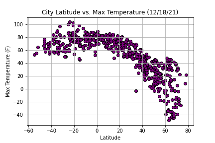
 
Looking at city latitude versus max temperature, it can be seen that temperature increase as one approaches the equator or a latitude of 0. It can be inferred from this that the data gathered contains more cities in the northern hemisphere and had there been more from the southern hemisphere a stronger bell shape may have been created.

 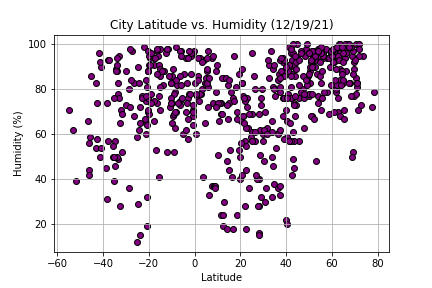
 
When looking at humidity versus latitude, there is no clear relationship between the two. Irregardless of latitude, cities tend to have higher percentage of humidity. A surprising amount of cities had upwards of 80% humidity when this data was collected.

 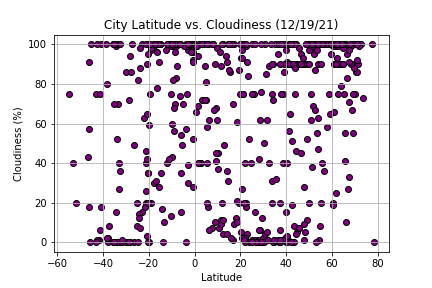

Similar to humidity, there is no clear relationship between latitude and a city's level of cloudiness. The percent of cloudiness is scattered with significant gathering occuring at 0 and 100 percent.

 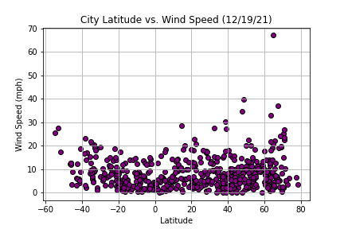
 
Wind speed and latitude did not display a strong relationship but a very weak one can be teased from the graph. Wind speeds seem to very slightly increase as the latitude increases. Again this relationship is very weak but is something of interest here.

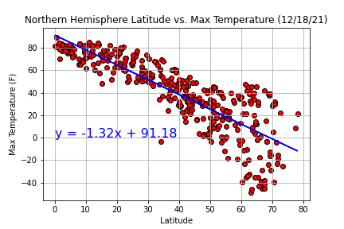  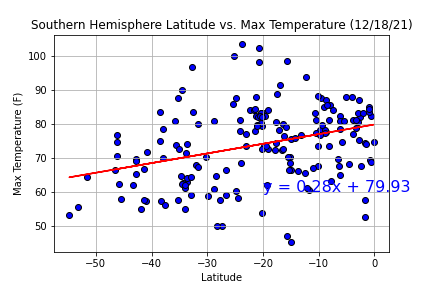

The linear regression here is modeling the relationship both the northern and southern hemispheres have between latitude and their maximum temperature based on the cities in those areas. The northern hemisphere shows a strong negative correlation in which as latitude increases the maximum temperature decreases. The southern hemisphere on the other hand shows a positive correlation between latitude and the maximum temperature though not nearly as strong. The lack of strength in the southern hemisphere's correlation is likely due to fewer number of cities from that area minimizing the amount of data able to be used on it for evaluation.

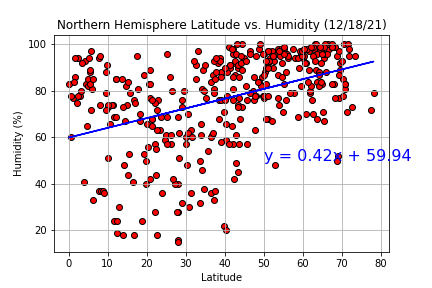  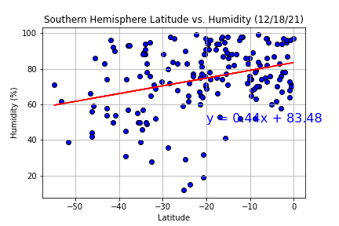

Here the linear regression is modeling the correlation between latitude and humidity for the northern and southern hemisphere. Both graphs produced a similar linear regression with a positive trend suggesting that as one moves north humidity increases. It should be noted that the correlation does not appear to be very strong as the linear regression shows the average trend while much of the data for both hemispheres is not significantly concentrated around the line representing linear regression.

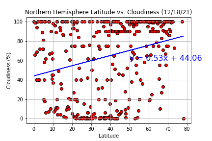  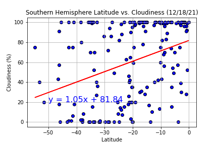

The linear regrssion in the graphs above is attempting to demostrate how latitude relates to cloudiness for the northern and southern hemisphere. While the linear regression would suggest a positive correlation between latitude and cloudiness for both hemispheres, by looking at the graphs it is clear the data for both is too sparsed to conclude this. Therefore, it is reasonable to conclude there is no correlation between cloudiness and latitude for either hemisphere.

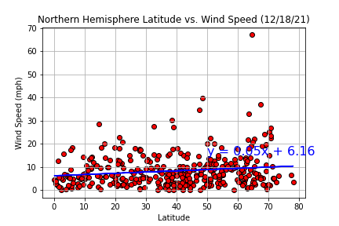  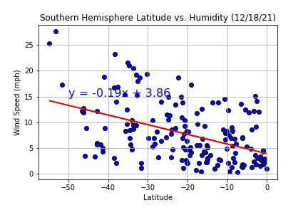

The final graphs use the linear regression model to compare the correlation between latitude and Wind Speed in the northern and southern hemisphere. In the northern hemisphere, there is a a very slight positive relationship between the two variables but as most of the data is concentrated between 0 and 20 mph it may be useful to examine that range in more detail. On the other hand, the southern hemisphere shows a more significant negative trend between the variables, but as mentioned previously this could be a misleading result considering the smaller data set for the southern hemisphere.

## VacantionPy
This script begins by reading in the csv file created from the previous script. From there a heatmap is created through Gmaps showing the cities in the csv rated by their humidity. A new data frame is then created based on specific weather criteria to narrow down the search for the optimal vacation spot. The parameters are set for the Gmaps Places API and a for loop is implemented to gather the information of a hotel within 5000 meters of each city in the narrowed list. Using this information, the hotels are then located and a marker layer is added to the previously generated heatmap.
